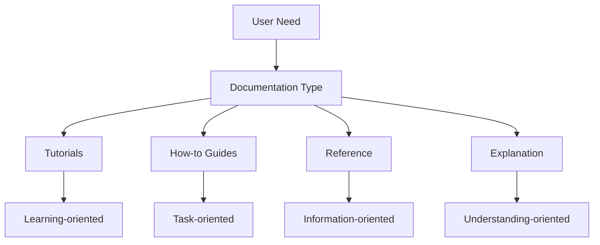

# Diataxis Documentation Framework

The Diataxis framework is a systematic approach to technical documentation, developed by Daniele Procida. It organizes documentation into four distinct types, each serving a different user need:

## The Four Documentation Types

### [Tutorials](tutorials.md)
- **Purpose**: Teaching and learning
- **Orientation**: Learning-oriented
- **Format**: Lessons that guide the user through a series of steps to learn a concept or skill
- **Analogy**: Like a cooking lesson with a child

### [How-to Guides](how-to-guides.md)
- **Purpose**: Solving problems
- **Orientation**: Task-oriented
- **Format**: Directions that guide the reader through a problem or towards a result
- **Analogy**: Like a recipe in a cookbook

### [Reference](reference.md)
- **Purpose**: Information
- **Orientation**: Information-oriented
- **Format**: Technical descriptions of the machinery and how to operate it
- **Analogy**: Like the nutritional information on a food package

### [Explanation](explanation.md)
- **Purpose**: Understanding
- **Orientation**: Understanding-oriented
- **Format**: Discussions that clarify and illuminate a topic
- **Analogy**: Like an article on the history and culture of a cuisine

## Key Principles

1. **Distinct Types**: Each documentation type has a distinct purpose and should be kept separate
2. **User Needs**: Documentation should be organized around user needs, not product features
3. **Clear Structure**: Each type follows its own structure and conventions
4. **Appropriate Language**: Each type uses appropriate language and tone for its purpose

## Implementation in Our Documentation

We have adopted the Diataxis framework for our documentation to provide a clear, consistent, and user-focused experience. By organizing our content according to these four types, we ensure that users can find the information they need in the format that best serves their current goal.

For more information, visit the [official Diataxis website](https://diataxis.fr/).
