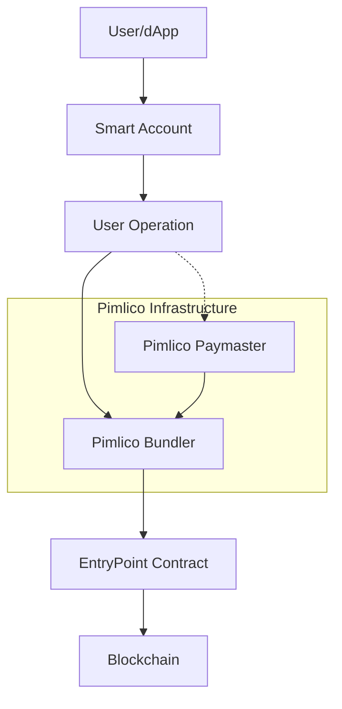
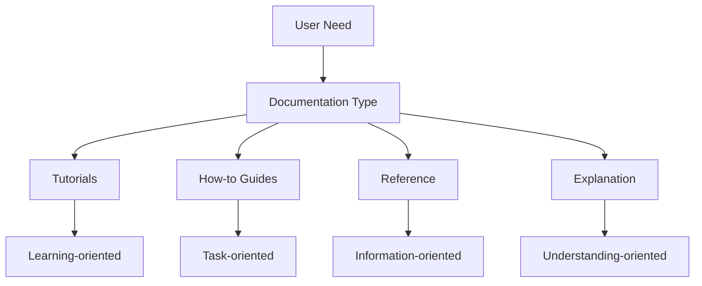

# System Patterns

## System Architecture

### Account Abstraction Architecture (ERC-4337)
Pimlico's infrastructure is built around the ERC-4337 account abstraction standard, which introduces several key components:

1. **Smart Accounts**: Contract-based accounts that replace traditional EOAs (Externally Owned Accounts)
2. **EntryPoint Contract**: A singleton contract that validates and executes user operations
3. **Bundlers**: Services that collect, validate, and submit user operations to the EntryPoint
4. **Paymasters**: Contracts that can sponsor gas fees for user operations
5. **UserOperation**: A data structure representing a transaction intent from a smart account

### Pimlico Infrastructure Components



## Technical Frameworks

### permissionless.js Library
The permissionless.js library is built on top of viem, a TypeScript interface for Ethereum. Key components include:

1. **Client Abstractions**:
   - `smartAccountClient`: For interacting with smart accounts
   - `bundlerClient`: For interacting with bundlers
   - `pimlicoPaymasterClient`: For interacting with Pimlico paymasters

2. **Account Implementations**:
   - Simple Account
   - Safe Account
   - Kernel Account
   - Biconomy Account
   - Light Account
   - ERC-7579 Accounts

3. **Action Modules**:
   - Bundler Actions
   - Smart Account Actions
   - Paymaster Actions
   - Public Actions

### API Services
Pimlico's API services follow RESTful design patterns and include:

1. **Bundler API**: Endpoints for submitting and managing user operations
2. **Paymaster API**: Endpoints for gas sponsorship and token payments
3. **Platform API**: Management endpoints for API keys, sponsorship policies, etc.

## Design Patterns

### Client-Action Pattern
The Permissionless library uses a client-action pattern where:
- Clients represent connections to specific services
- Actions are functions that can be performed using those clients
- Decorators extend clients with additional functionality

```typescript
// Example pattern
const client = createClient({
  transport,
  chain
})
  .extend(bundlerActions)
  .extend(publicActions)
```

### Factory Pattern
Account creation uses factory patterns to instantiate different types of smart accounts:

```typescript
// Example pattern
const account = signerToSimpleSmartAccount(client, {
  entryPoint,
  factoryAddress,
  signer
})
```

### Builder Pattern
User operations are constructed using a builder-like pattern:

```typescript
// Example pattern
const userOperation = await account.prepareUserOperation({
  target,
  data,
  value
})
```

### Middleware Pattern
The bundler infrastructure uses middleware patterns for request processing:

1. Request validation
2. Gas estimation
3. Simulation
4. Paymaster integration
5. Submission to mempool

## Component Relationships

### Smart Account and Signer Relationship
Smart accounts are controlled by signers, which can be:
- EOA private keys
- Multi-signature schemes
- External services (MPC, social logins)
- Hardware wallets

### Bundler and EntryPoint Relationship
Bundlers interact with the EntryPoint contract to:
- Validate user operations
- Estimate gas costs
- Submit user operations
- Query operation status

### Paymaster and Smart Account Relationship
Paymasters can sponsor transactions for smart accounts based on:
- Verification logic
- Token payments
- Sponsorship policies
- Application-specific rules

## Deployment Models

### Self-Hosted Options
- Bundler nodes can be self-hosted
- Paymaster contracts can be deployed by developers

### Managed Services
- Pimlico provides managed bundler infrastructure
- Pimlico offers paymaster services with various payment models

## Integration Patterns

### Wallet Integration
Wallets can integrate with Pimlico's infrastructure through:
- Direct API calls
- Permissionless library
- Custom bundler configurations

### dApp Integration
dApps can integrate account abstraction through:
- Wagmi connectors
- Direct client usage
- Sponsorship policies for gas abstraction

## Documentation Patterns

### Diataxis Framework
The documentation follows the Diataxis framework, which organizes content into four distinct types:



1. **Tutorials**: Learning-oriented content that guides users through a series of steps to learn a concept or skill
   - Example: "Getting Started with Permissionless"
   - Focus: Practical experience and learning

2. **How-to Guides**: Task-oriented content that helps users accomplish specific goals
   - Example: "How to Implement Gas Sponsorship"
   - Focus: Solving real-world problems

3. **Reference**: Information-oriented content that provides technical details
   - Example: "API Reference for BundlerClient"
   - Focus: Accurate and complete information

4. **Explanation**: Understanding-oriented content that explains concepts and provides context
   - Example: "Understanding Account Abstraction"
   - Focus: Deepening knowledge and providing context
